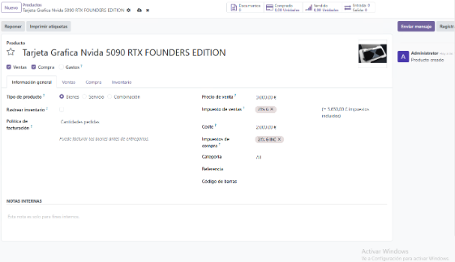

# Creación de Categorías y Productos en ODoo

#### Asignado a Ángel Herrera Allende.

## Introducción
En este documento voy a explicar los pasos que he realizado para la creación de las categorías y luego poner productos en estas.

## Capturas y Explicaciones

### Acceder al menu de categorias 

Navegamos al menú de categorías para poder ir a crearlas.

Hacemos clic en nuevo para crear la categoria.
### Creacion de la categoria PC

Creacion de la categoria PC.

### Creacion de la categoria Iluminacion

Creacion de la categoria Iluminacion

### Creacion de la categoria Electrodomesticos

Creacion de la categoria Electrodomesticos

### Resultado final de la creacions de nuestras Categorias 

 
Aqui podemos ver el menus de categorias tras haberlas creado

### Vamos al menu de Productos

 Accedemos al menú de productos para agregar uno nuevo
 Presionamos "Nuevo" para comenzar.

### Creacion del primer producto

 
Rellenamos los campos de nombre para crearlo

###  Creacion del producto segundo

Rellenamos los campos de nombre para crearlo

### Creacion del tercer producto

Rellenamos los campos de nombre para crearlo

###  Creacion del cuarto producto

Rellenamos los campos de nombre para crearlo

### Creacion del quinto producto

Rellenamos los campos de nombre para crearlo

### Resultado final de la creacion de nuestros productos 

Y asi se veria el resultado final de productos
