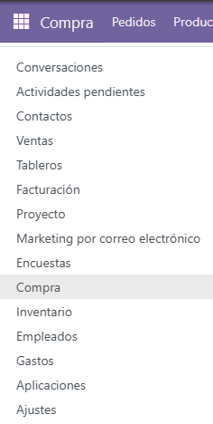
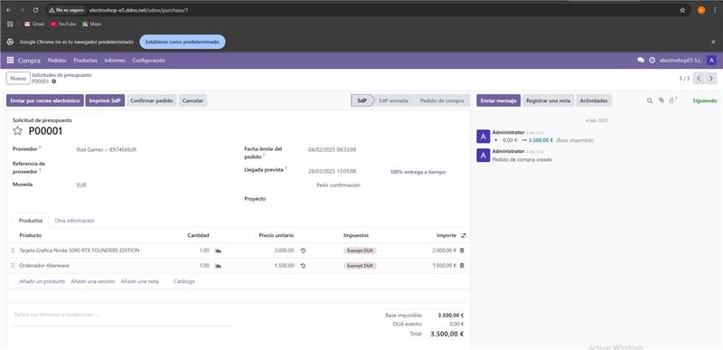
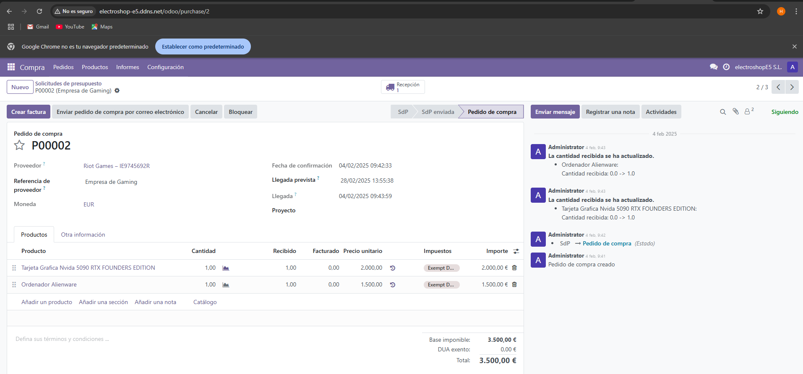
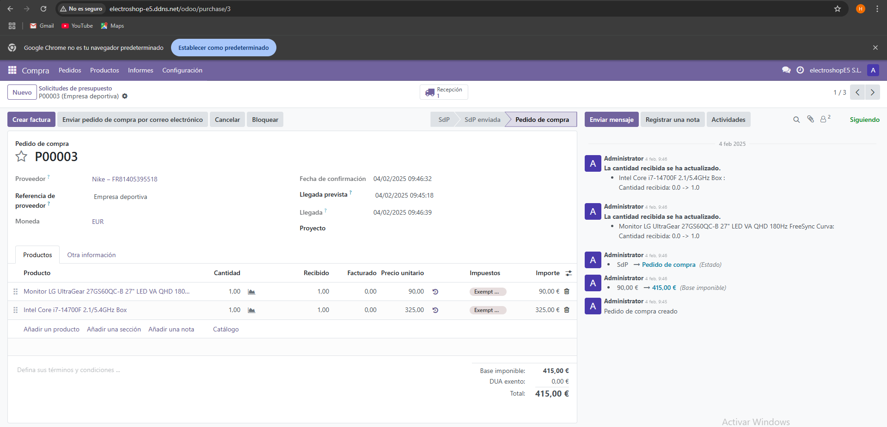
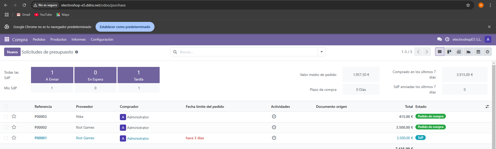
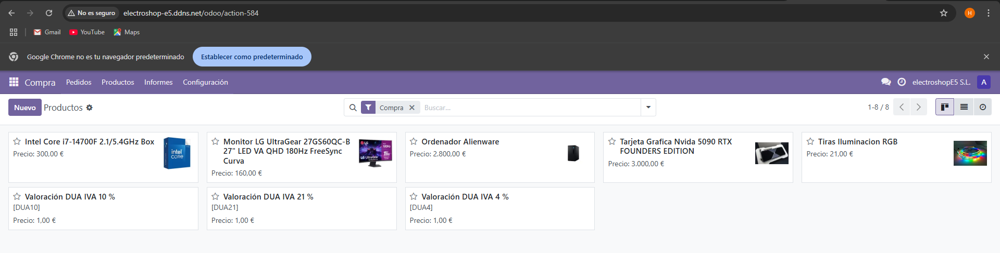

#  Paso 4.-  Gestión de una compra: Pedidos a proveedores
#### Asignado a Ulises Cuadrado García

## Gestión de compras

En este aparatado crearemos varias compras para posteriormente tener el stock suficiente como para poder realizar ventas a unos clientes ya predefinidos anteriormente.

Lo primero que tendremos que hacer será acceder al apartado de **compras**.

De seguido empezaremos con la creacion de las compras.

Para realizar la compra tendremos que crear una solicitud de **presupuesto** a una empresa externa y este paso lo realizaremos varias veces como para poder tener el stock necesario.

Y este sría el resultado de las compras.

Una vez realizadas las compras nos quedaria el **inventario** de la siguiente manera.

