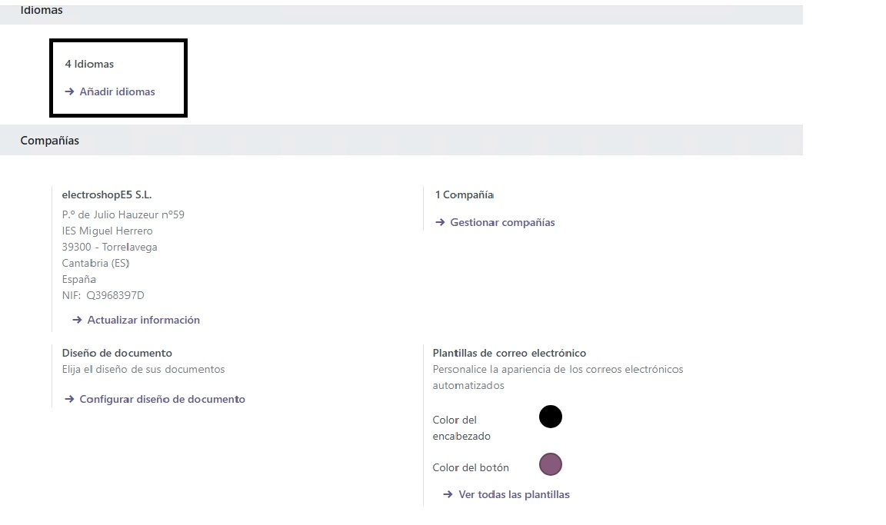

# **Configuración en Odoo5: Información General de la Empresa, Instalación de Idiomas y Módulos**
### Asignado a Hafsa Katkout Aabil.
## **Introducción**

Después de instalar Odoo en nuestra máquina virtual y configurar correctamente los servicios necesarios, procedemos a realizar los primeros pasos de configuración. Odoo es un **ERP (Enterprise Resource Planning)** que permite gestionar de manera integrada diferentes áreas de la empresa. Su funcionamiento se basa en la instalación de módulos que cubren aspectos esenciales como ventas, compras, inventario, recursos humanos y contabilidad. 

Tras completar estos pasos, accedemos a nuestro dominio'electroshop-e5.ddns.net' configurado con **No-IP**, el cual dirige la petición al **proxy inverso** que a su vez redirige la solicitud a la máquina donde instalamos Odoo. Esto nos lleva a la página de acceso del sistema, donde iniciamos sesión con las siguientes credenciales:

- **Correo electrónico**: `odoo5@electroshop.com`
- **Contraseña**: `usuario@E5`

---

## **1. Configuración de datos de la Empresa**

### **Paso 1: Modificar la información general de la empresa**
- Navegamos a **Ajustes** > **Compañias** > y entramos en la Configuración de la empresa.
- Seleccionamos la empresa predeterminada y editamos los siguientes campos:

### **Datos de la Empresa**

| Campo               | Valor                              |
|---------------------|----------------------------------|
| **Nombre**         | ElectroshopE5 S.L.               |
| **Dirección**      | Pº de Julio Hauzeur nº59         |
| **Dirección 2**    | IES Miguel Herrero               |
| **Código Postal**  | 39300                             |
| **Ciudad**         | Torrelavega                       |
| **Provincia**      | Cantabria (ES)                   |
| **País**          | España                            |
| **NIF**           | Q3968397D                             |
| **Moneda**        | EUR                               |
| **Teléfono**      | 123456789                         |
| **Móvil**         | 123456789                         |
| **Correo Electrónico** | info@electroshopE5.com     |
| **Sitio Web**     | https://www.electroshopE5.com    |
| **Dominio**      | www.electroshopE5.com      |


### **Paso 2: Subir el logo de la empresa**
- Dentro de la misma pantalla, buscamos la opción **Logo de la Empresa**.
- Subimos el archivo de imagen correspondiente.

- Guardamos los cambios.

---

## **2. Instalación de Idiomas**

- Vamos a **Ajustes** > **Idiomas** > **Añadir idiomas**.
- Hacemos clic en **Añadir** y agregamos los siguientes idiomas:
  - **Español (Spanish)**

    

  - **Inglés (English)**

    
  - **Francés (Français)**

    

  - **Árabe (Arabic)**

    

- Guardamos los cambios y confirmamos la instalación.

---

## **3. Instalación de Módulos Esenciales**

### **Paso 1: Acceder a la gestión de módulos**

  - Nos dirigimos al **Panel de Aplicaciones** :

    


### **Paso 2: Instalar los módulos clave**
Buscamos e instalamos los siguientes módulos:
  - **Ventas**
  - **Compras**
  - **Recursos Humanos**
  - **Inventario**
  - **Empleados**
  - **Contabilidad**

### **Paso 3: Verificar la instalación , y ver los módulos instalados y no instalados**
- Aplicamos el **filtro** para ver qué módulos ya están instalados :escribimos **Instalado**.
- Confirmamos que los módulos necesarios aparecen con los módulos instalados :

- Aplicamos otro filtro para ver los módulos que **aún no están instalados**:escribimos en el filtro :**No instalado**.

- Si algún módulo no se instaló lo instalamos .

---

## **4. Comprobación Final**
1. Nos **desconectamos** y volvemos a iniciar sesión en Odoo.
- Abrimos un navegador web y accedemos a Odoo en la siguiente URL:
  ```
  http://electroshop-e5.ddns.net
  ```
- Introducimos las credenciales y hacemos clic en **Iniciar sesión**:

  

2. Verificamos que la información de la empresa se haya guardado correctamente :

3. Comprobamos los idiomas :

4. Confirmamos que los módulos instalados aparecen en el panel de administración.


---

