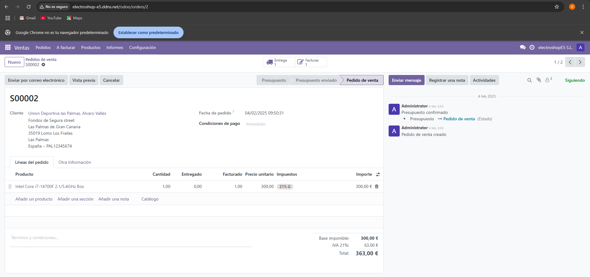
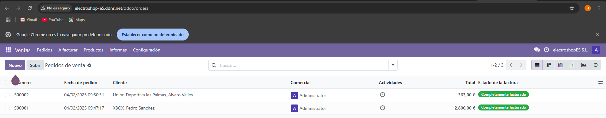

# Gestión de una venta: Pedidos de clientes

#### Asignado a Ulises Cuadrado García

## Creación de ventas

En este apartado crearemos varias ventas utilizando los productos adquiridos anteriormente.

Lo primero que tendremos que hacer será llegar al apartado de las **ventas** y crear una **nueva venta**.

Ahora pasaremos a la propia creación de las ventas, cada una de ellas con **productos y clientes** diferentes.

La **primera venta** es hacia el cliente Pedro Sanchez y comprara un Ordenador AlienWare el cual adquirimos anteriormente y está en nuestro stock.

La **segunda venta** es hacia el cliente Alvaro Valles y comprara un procesador Intel Core I7 que al igual que el Ordenador AlienWare lo adquirimos previamente.

Una vez fijadas las ventas este sería el resultado final.

